# Software Requirements Specification
## Aviary — Personal RAG Platform

**Version:** 1.0  
**Date:** 2026-06-21  
**Branch:** `migrate-to-mongodb`  
**Author:** The Quan Phung

---

## Table of Contents

1. [Introduction](#1-introduction)
2. [System Overview](#2-system-overview)
3. [Context Diagram](#3-context-diagram)
4. [Tech Stack](#4-tech-stack)
5. [Architecture](#5-architecture)
6. [Data Models](#6-data-models)
7. [Functional Requirements](#7-functional-requirements)
8. [Non-Functional Requirements](#8-non-functional-requirements)
9. [API Surface](#9-api-surface)
10. [Document Ingestion Pipeline](#10-document-ingestion-pipeline)
11. [RAG Chat Flow](#11-rag-chat-flow)
12. [Report Generation Flow](#12-report-generation-flow)
13. [Event System](#13-event-system)
14. [Security Model](#14-security-model)
15. [Deployment](#15-deployment)

---

## 1. Introduction

### 1.1 Purpose

Aviary is a personal, notebook-centric **Retrieval-Augmented Generation (RAG)** platform. Users organise documents into notebooks, ask questions grounded in those documents via a streaming AI chat, and produce structured knowledge artefacts — briefings, quizzes, flashcards, mind maps, study guides, and blog posts — all generated by LLMs with retrieved context.

### 1.2 Scope

This document covers the full system: backend API, frontend SPA, data models, external service integrations, security requirements, and deployment topology. It reflects the state of the `migrate-to-mongodb` branch, which completed the migration from PostgreSQL/pgvector to **MongoDB Atlas** with Beanie ODM.

### 1.3 Definitions

| Term | Meaning |
|---|---|
| **Notebook** | A user-created collection that groups documents, chat history, and reports |
| **Document** | A file (PDF, DOCX, TXT, MD) or inline note uploaded into a notebook |
| **Chunk** | A fixed-size text segment extracted from a document for vector indexing |
| **RAG** | Retrieval-Augmented Generation — grounding LLM answers in retrieved document excerpts |
| **Report** | A structured LLM output (briefing, quiz, etc.) derived from a notebook's content |
| **AG-UI** | A streaming protocol for agent-to-UI communication used by the chat endpoint |
| **SSE** | Server-Sent Events — real-time push from server to browser |

---

## 2. System Overview

Aviary lets a single user (or a small team) build a personal knowledge base out of uploaded files and then interact with that knowledge through two channels:

1. **Conversational chat** — a streaming chat agent that cites specific document chunks in its answers.
2. **Report generation** — background tasks that produce structured artefacts (flashcards, mind maps, quizzes, etc.) from the notebook's indexed content.

The system is designed for **self-hosting**: all components run via Docker Compose, with MinIO replacing AWS S3 and MongoDB Atlas replaceable by any replica-set MongoDB. Cloud deployment is supported by providing external `MONGODB_URL`, `S3_*`, and `RABBITMQ_URL` values.

---

## 3. Context Diagram

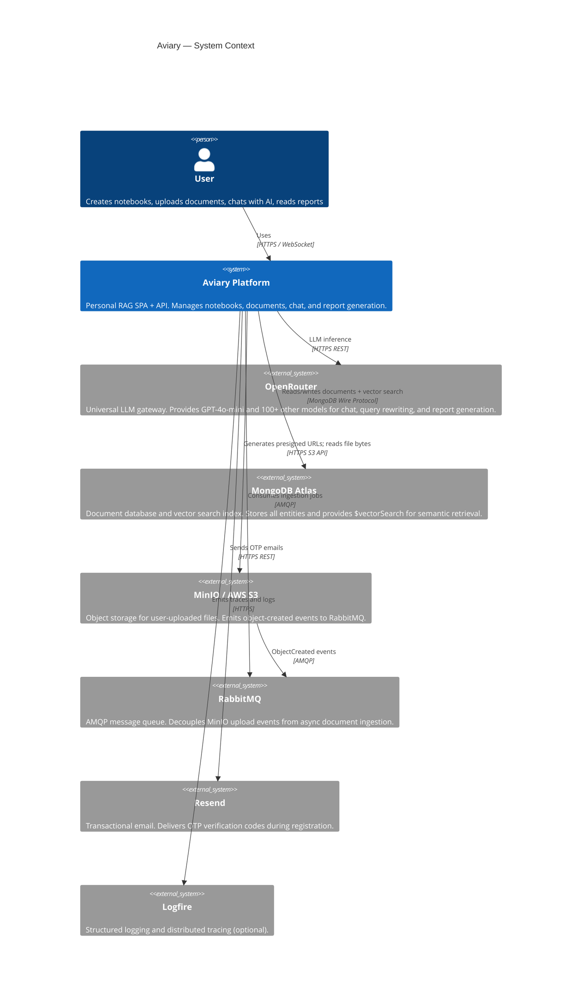

---

## 4. Tech Stack

### 4.1 Backend

| Layer | Technology | Notes |
|---|---|---|
| Runtime | **Python 3.12+** | |
| Web framework | **FastAPI** | Async, OpenAPI auto-docs |
| Package manager | **uv** | Lock-file based |
| ODM | **Beanie** | Async MongoDB ODM on top of motor |
| Database driver | **motor** | Async MongoDB driver |
| Data validation | **Pydantic v2** | Models + settings |
| Settings | **pydantic-settings** | Loads `.env` |
| Auth | **python-jose** + **pwdlib** (Argon2) | JWT + password hashing |
| LLM agent | **pydantic-ai** | Type-safe agent framework |
| Email | **resend** | OTP delivery |
| File storage | **boto3** | S3 / MinIO client |
| Message queue | **aio-pika** | Async AMQP |
| PDF parsing | **pymupdf4llm** | LLM-optimised extraction |
| DOCX parsing | **python-docx** | Word document extraction |
| Text splitting | **langchain-text-splitters** | Recursive character splitter |
| Telemetry | **logfire** | Structured logging |
| Linting/format | **ruff** | Line length 88, strict |
| Testing | **pytest** + **pytest-asyncio** + **mongomock-motor** | 13 test files |

### 4.2 Frontend

| Layer | Technology | Notes |
|---|---|---|
| Framework | **React 19** | Concurrent features |
| Build tool | **Vite 6** | HMR, ESM output |
| Language | **TypeScript 5** | Strict mode |
| Routing | **React Router 7** | Route guards |
| Server state | **TanStack Query v5** | Data fetching + cache |
| Client state | **Zustand** | Auth store, theme store |
| UI primitives | **shadcn/ui** | Radix-based components |
| Styling | **Tailwind CSS v4** | Utility-first |
| Chat UI | **@assistant-ui/react** + **@assistant-ui/react-ag-ui** | AG-UI streaming chat |
| HTTP client | **axios** | Token refresh interceptors |

### 4.3 Infrastructure

| Component | Technology | Role |
|---|---|---|
| Containers | **Docker Compose** | Local dev + prod |
| Object storage | **MinIO** (dev) / **AWS S3** (prod) | File storage |
| Database | **MongoDB Atlas** | All data + vector index |
| Message queue | **RabbitMQ** | Async ingestion fan-out |
| CI | **GitHub Actions** | pytest + lint + build on PRs |

---

## 5. Architecture

### 5.1 High-Level Component Diagram

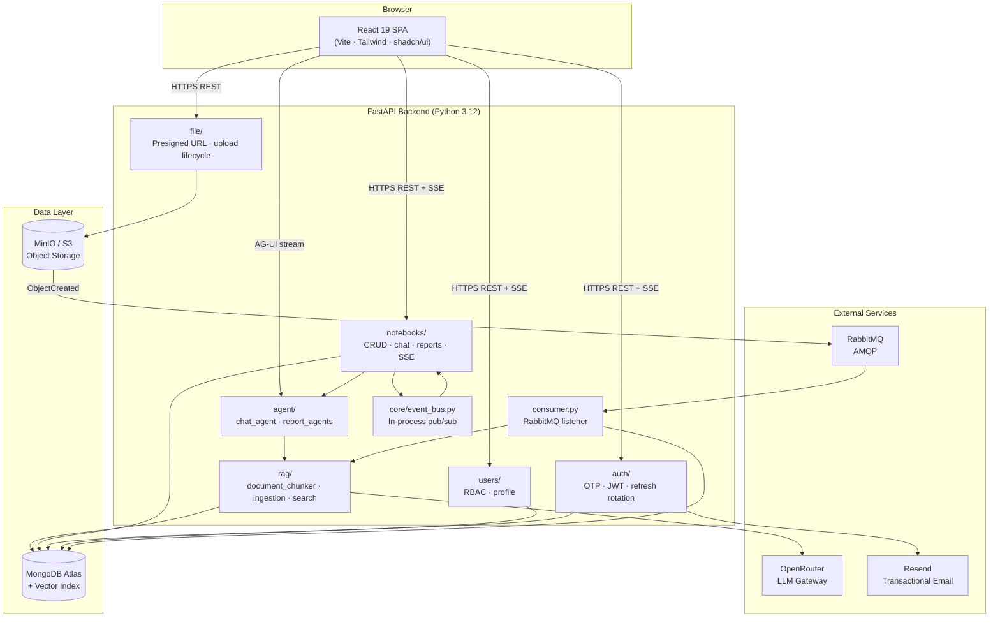

### 5.2 Module Dependency Map

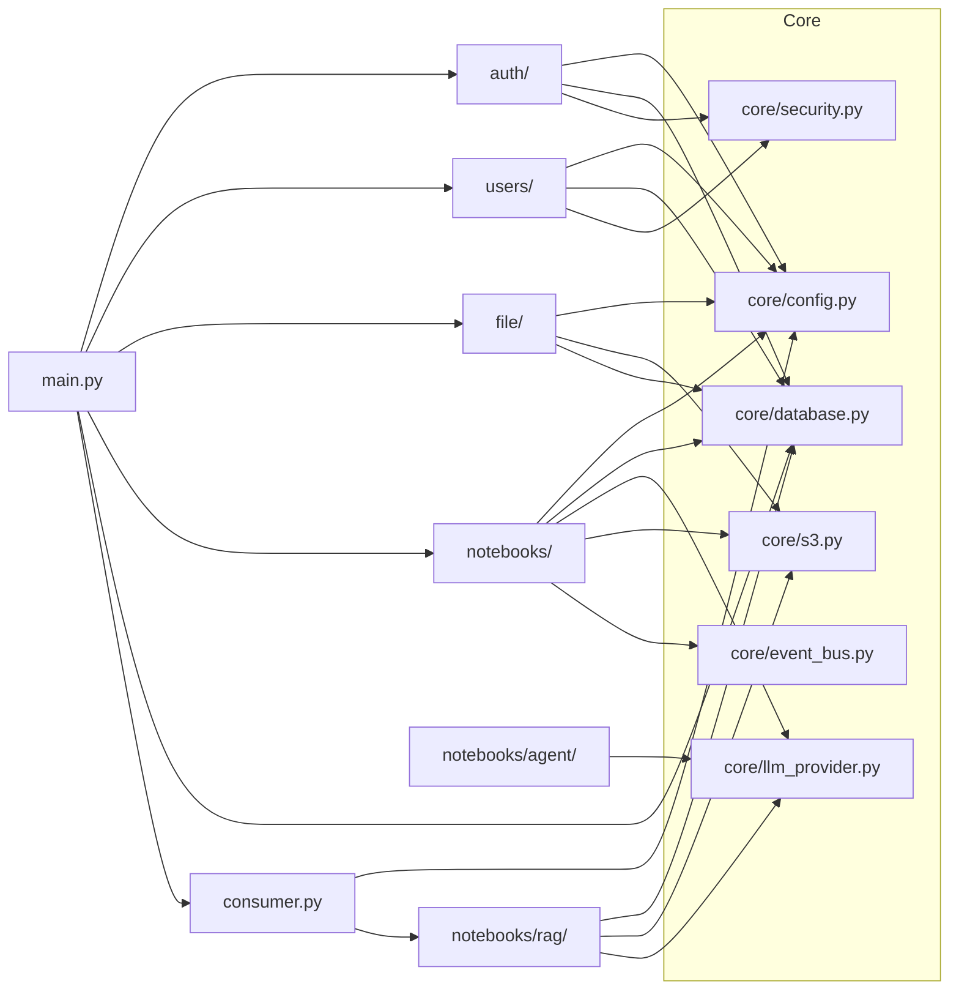

---

## 6. Data Models

### 6.1 Entity-Relationship Diagram

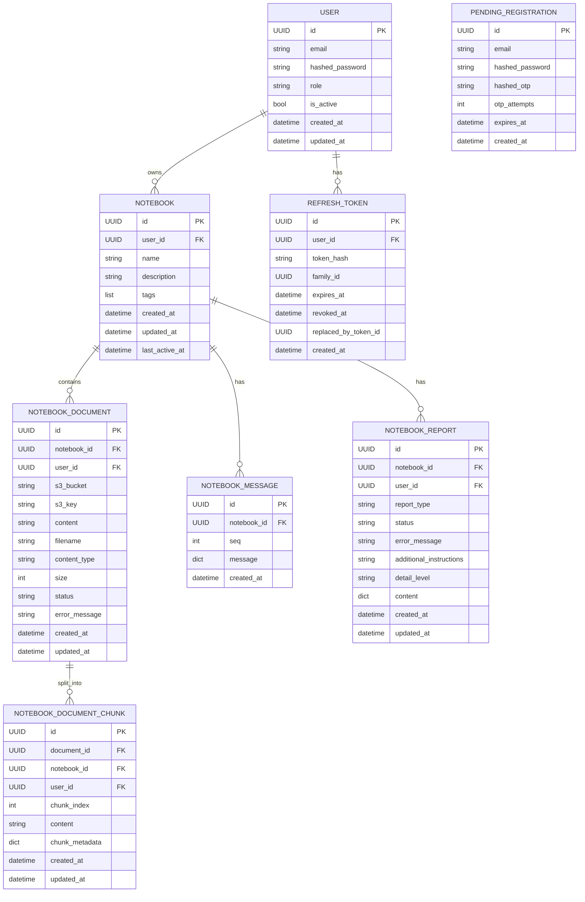

### 6.2 Document Status Lifecycle

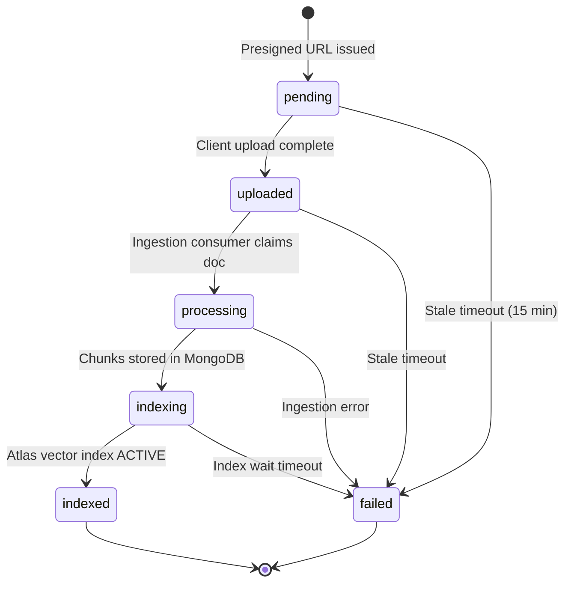

### 6.3 Report Status Lifecycle

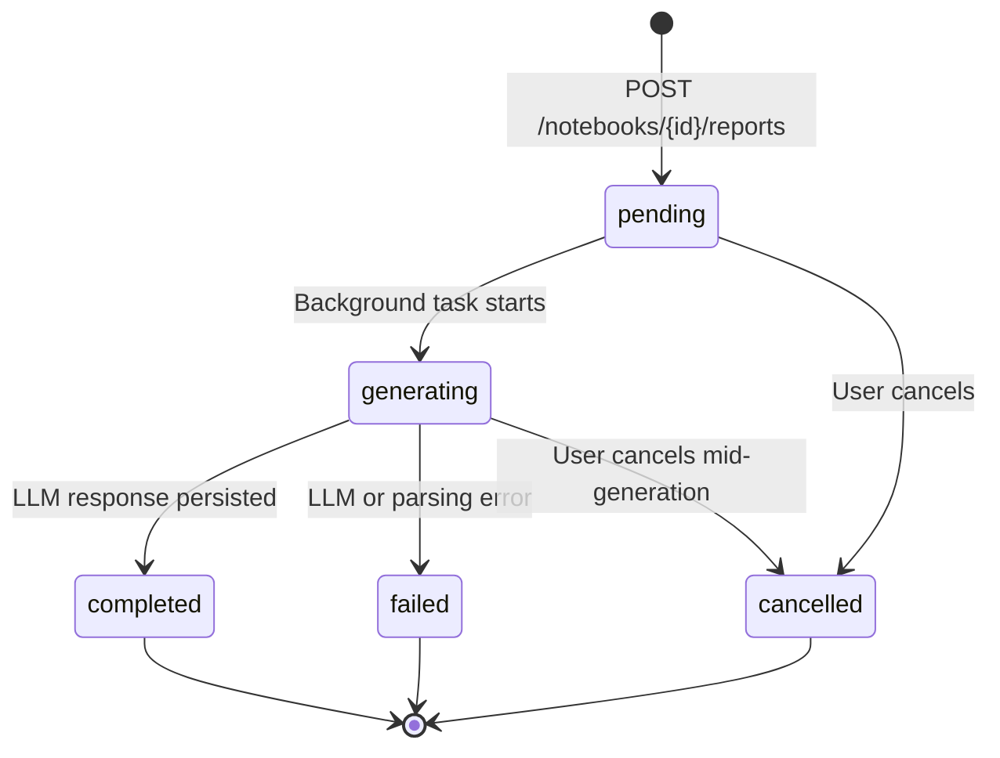

---

## 7. Functional Requirements

### 7.1 Authentication & Identity (FR-AUTH)

| ID | Requirement |
|---|---|
| FR-AUTH-01 | Users register with email + password; system sends a time-limited OTP via Resend |
| FR-AUTH-02 | OTP verification creates a `User` record and returns access + refresh tokens as HTTP-only cookies |
| FR-AUTH-03 | OTPs expire after `OTP_EXPIRE_MINUTES` (default 10); max `OTP_MAX_ATTEMPTS` (default 5) before lockout |
| FR-AUTH-04 | Login returns short-lived access token (30 min) and long-lived refresh token (30 days) |
| FR-AUTH-05 | Refresh token rotation: each refresh issues a new token and revokes the old one; reuse of a revoked token invalidates the entire family |
| FR-AUTH-06 | Logout revokes the current refresh token and clears both cookies |
| FR-AUTH-07 | RBAC: `role=user` (default) vs `role=admin`; admin-only endpoints return 403 for non-admins |

### 7.2 Notebook Management (FR-NB)

| ID | Requirement |
|---|---|
| FR-NB-01 | Users create notebooks with a name (max 120 chars), optional description, and up to 20 tags |
| FR-NB-02 | Notebook list and detail endpoints return only the authenticated user's notebooks |
| FR-NB-03 | `GET /{id}/populate` returns notebook with document count and total query count |
| FR-NB-04 | Deleting a notebook cascade-deletes all child documents, chunks, messages, and reports |
| FR-NB-05 | `PATCH /{id}` supports partial updates (name, description, tags) |
| FR-NB-06 | `POST /{id}/touch` updates `last_active_at` for recency sorting |

### 7.3 Document Ingestion (FR-INGEST)

| ID | Requirement |
|---|---|
| FR-INGEST-01 | Supported file types: PDF, DOCX, TXT, Markdown |
| FR-INGEST-02 | Upload flow: client requests presigned URL → uploads directly to MinIO/S3 → MinIO emits AMQP event → consumer ingests |
| FR-INGEST-03 | Fallback without RabbitMQ: periodic poll of `pending`/`uploaded` documents |
| FR-INGEST-04 | Ingestion: extract text → split into chunks → store `NotebookDocumentChunk` → wait for Atlas vector index ACTIVE |
| FR-INGEST-05 | Documents stuck in `pending`/`processing` for > `FILE_INGESTION_PROCESSING_TIMEOUT_MINUTES` are marked `failed` |
| FR-INGEST-06 | Users can create inline notes (plain text) stored directly as document content without S3 |

### 7.4 RAG Chat (FR-CHAT)

| ID | Requirement |
|---|---|
| FR-CHAT-01 | `POST /notebooks/{id}/chat` streams responses via the AG-UI protocol |
| FR-CHAT-02 | The chat agent retrieves top-K (default 6) semantically relevant chunks before answering |
| FR-CHAT-03 | Optional query rewriting (`ENABLE_QUERY_REWRITE`) improves retrieval precision |
| FR-CHAT-04 | Agent responses must cite sources; citations reference chunk filenames and indices |
| FR-CHAT-05 | Chat history persists as `NotebookMessage` documents; trimmed to last ~15 non-system messages per turn |
| FR-CHAT-06 | `GET /notebooks/{id}/chat/history` returns full transcript with optional reasoning steps |
| FR-CHAT-07 | When no LLM provider is configured the endpoint returns 503 with a descriptive message |

### 7.5 Report Generation (FR-REPORT)

| ID | Requirement |
|---|---|
| FR-REPORT-01 | Report types: `briefing`, `study_guide`, `blog`, `custom`, `mindmap`, `quiz`, `flashcards` |
| FR-REPORT-02 | Reports run as background `asyncio` tasks; client observes status via SSE or REST polling |
| FR-REPORT-03 | Each report type has a dedicated pydantic-ai agent with a type-specific system prompt |
| FR-REPORT-04 | Quiz and flashcard reports support `detail_level`: `fewer`, `standard`, `more` |
| FR-REPORT-05 | Reports can be cancelled while `pending` or `generating` |
| FR-REPORT-06 | On restart, reports stuck in `pending`/`generating` are re-queued by the lifespan hook |
| FR-REPORT-07 | Users can delete completed/failed/cancelled reports |

### 7.6 Real-Time Events (FR-SSE)

| ID | Requirement |
|---|---|
| FR-SSE-01 | `GET /notebooks/events` is an SSE endpoint scoped to the authenticated user |
| FR-SSE-02 | Events are emitted for every document status transition |
| FR-SSE-03 | Events are emitted for every report status transition |
| FR-SSE-04 | The in-process event bus decouples publishers (ingestion, report agents) from SSE subscribers |

---

## 8. Non-Functional Requirements

### 8.1 Performance (NFR-PERF)

| ID | Requirement |
|---|---|
| NFR-PERF-01 | Chat responses must begin streaming within 3 s of request receipt under normal load |
| NFR-PERF-02 | Document ingestion must complete within `FILE_INGESTION_PROCESSING_TIMEOUT_MINUTES` (default 15 min) |
| NFR-PERF-03 | Vector search must return top-K results within 2 s |
| NFR-PERF-04 | p95 latency for non-LLM endpoints must be < 200 ms |

### 8.2 Security (NFR-SEC)

| ID | Requirement |
|---|---|
| NFR-SEC-01 | Passwords stored as Argon2 hashes — never plaintext |
| NFR-SEC-02 | JWTs signed with HS256; secret loaded from env, never hardcoded |
| NFR-SEC-03 | Refresh tokens stored as SHA-256 hashes; raw tokens transmitted only over TLS |
| NFR-SEC-04 | Refresh token family invalidation prevents token reuse attacks |
| NFR-SEC-05 | All notebook data scoped by `user_id`; cross-user access returns 404 (not 403) to avoid enumeration |
| NFR-SEC-06 | HTTP-only, `SameSite=Lax`, `Secure` (prod) cookies prevent XSS token theft |
| NFR-SEC-07 | OTP brute-force protection: max 5 attempts before the registration is locked |
| NFR-SEC-08 | CORS origins are an explicit allowlist; wildcards not permitted in production |

### 8.3 Reliability (NFR-REL)

| ID | Requirement |
|---|---|
| NFR-REL-01 | Failed ingestion jobs are routed to a dead-letter queue for inspection |
| NFR-REL-02 | RabbitMQ consumer reconnects automatically after broker restart |
| NFR-REL-03 | Reports stuck across restarts are recovered in the `lifespan` hook |
| NFR-REL-04 | Stale documents are transitioned to `failed` deterministically by timeout helpers |

### 8.4 Observability (NFR-OBS)

| ID | Requirement |
|---|---|
| NFR-OBS-01 | Structured logging via Logfire when `LOGFIRE_TOKEN` is set |
| NFR-OBS-02 | Every FastAPI request is traced; pydantic-ai agent calls are instrumented |
| NFR-OBS-03 | Document and report status transitions are logged with timestamps |

### 8.5 Portability (NFR-PORT)

| ID | Requirement |
|---|---|
| NFR-PORT-01 | Full stack runs with `docker compose up --build` from a single `.env` file |
| NFR-PORT-02 | Backend is stateless; horizontal scaling is possible behind a load balancer |
| NFR-PORT-03 | MinIO can be replaced with AWS S3 by swapping `S3_ENDPOINT_URL` |

---

## 9. API Surface

### 9.1 Endpoint Summary

| Method | Path | Description |
|---|---|---|
| POST | `/api/v1/auth/registrations` | Start registration, send OTP email |
| POST | `/api/v1/auth/email-verifications` | Verify OTP, create user |
| POST | `/api/v1/auth/sessions` | Login |
| POST | `/api/v1/auth/token-refreshes` | Rotate refresh token |
| DELETE | `/api/v1/auth/sessions/current` | Logout |
| GET | `/api/v1/users/me` | Get current user |
| GET | `/api/v1/users/` | List users (admin) |
| POST | `/api/v1/file/presigned-url` | Generate upload/download presigned URL |
| POST | `/api/v1/file/upload-failed` | Mark document upload as failed |
| GET | `/api/v1/notebooks/` | List notebooks |
| POST | `/api/v1/notebooks/` | Create notebook |
| GET | `/api/v1/notebooks/events` | SSE stream of document/report events |
| GET | `/api/v1/notebooks/{id}` | Get notebook |
| PATCH | `/api/v1/notebooks/{id}` | Update notebook |
| DELETE | `/api/v1/notebooks/{id}` | Delete notebook (cascade) |
| GET | `/api/v1/notebooks/{id}/populate` | Notebook with doc/query counts |
| POST | `/api/v1/notebooks/{id}/touch` | Update last_active_at |
| GET | `/api/v1/notebooks/{id}/documents` | List documents |
| DELETE | `/api/v1/notebooks/{id}/documents/{doc_id}` | Delete document + chunks |
| GET | `/api/v1/notebooks/{id}/documents/chunks` | Get chunks by filename |
| POST | `/api/v1/notebooks/{id}/notes` | Create inline note |
| POST | `/api/v1/notebooks/{id}/chat` | Streaming chat (AG-UI) |
| GET | `/api/v1/notebooks/{id}/chat/history` | Chat transcript |
| GET | `/api/v1/notebooks/{id}/reports` | List reports |
| POST | `/api/v1/notebooks/{id}/reports` | Generate report (background) |
| GET | `/api/v1/notebooks/{id}/reports/{rid}` | Get report |
| POST | `/api/v1/notebooks/{id}/reports/{rid}/cancel` | Cancel report |
| DELETE | `/api/v1/notebooks/{id}/reports/{rid}` | Delete report |

### 9.2 Authentication Sequence

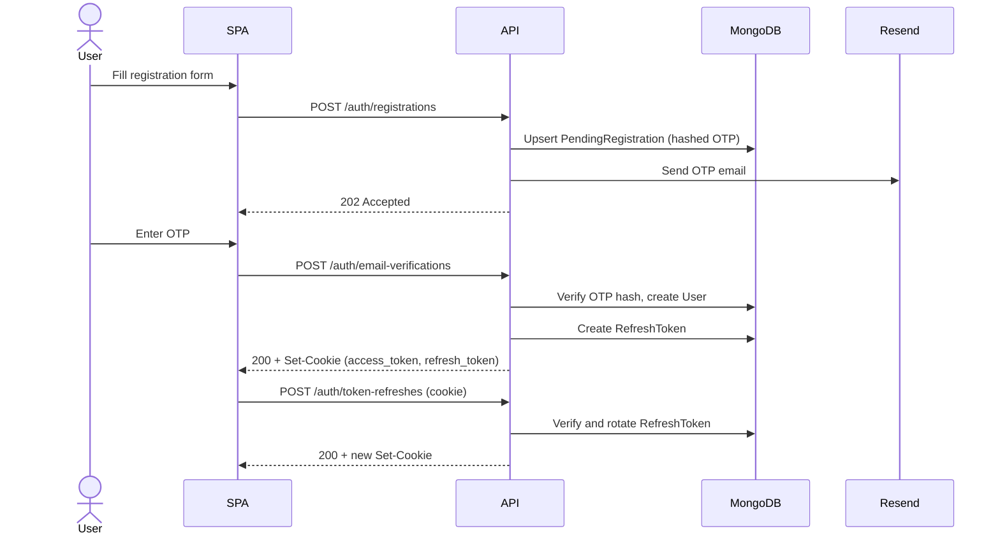

---

## 10. Document Ingestion Pipeline

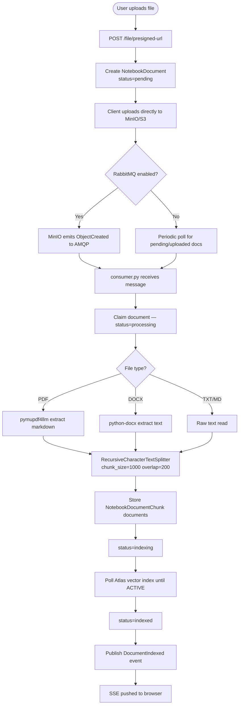

---

## 11. RAG Chat Flow

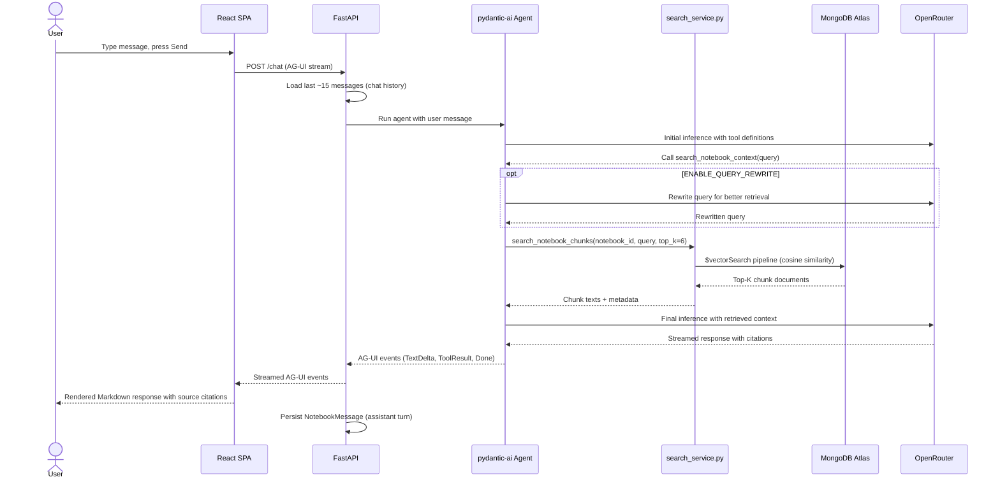

---

## 12. Report Generation Flow

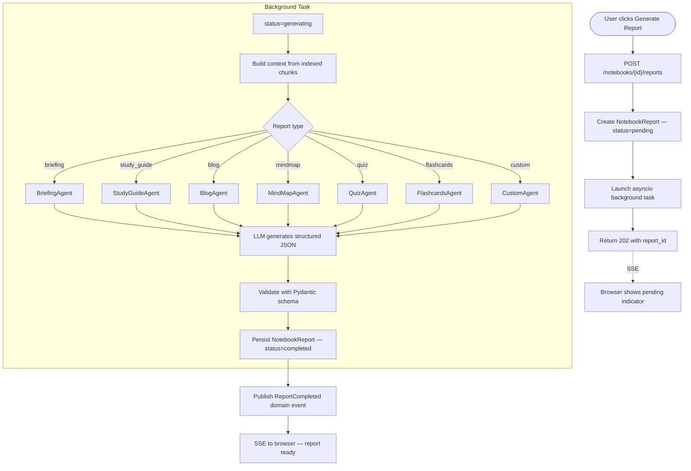

---

## 13. Event System

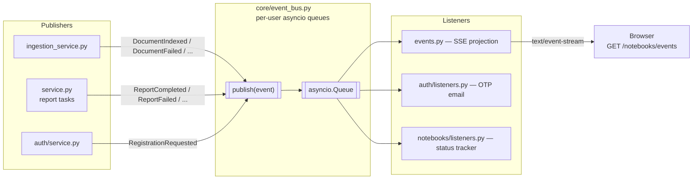

---

## 14. Security Model

### 14.1 Token Architecture

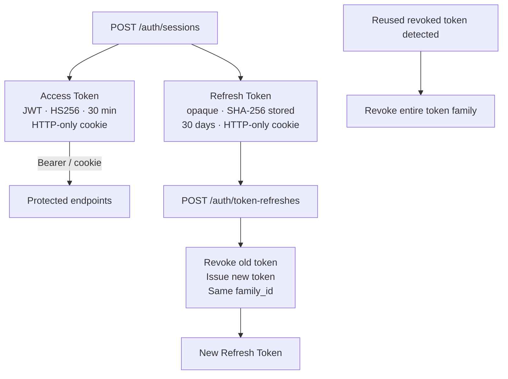

### 14.2 Data Isolation

Every query against `Notebook`, `NotebookDocument`, `NotebookDocumentChunk`, `NotebookMessage`, and `NotebookReport` includes a `user_id` filter derived from the authenticated JWT claim. There is no shared data between users at the application layer. Cross-user access returns 404 (not 403) to avoid resource enumeration.

---

## 15. Deployment

### 15.1 Development Topology

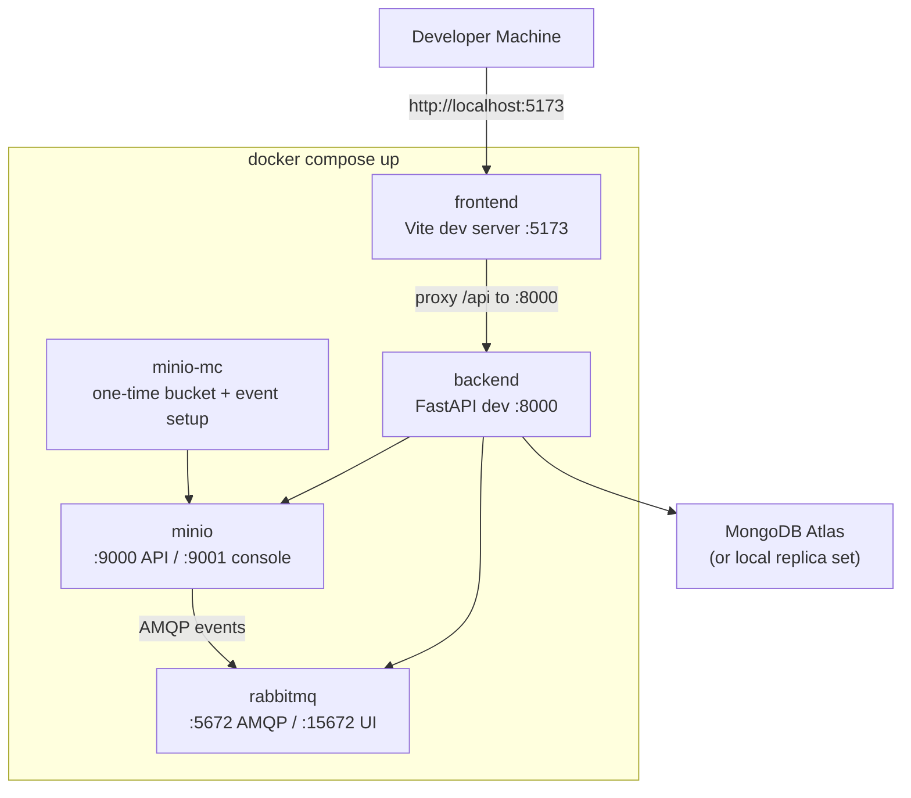

### 15.2 Production Topology

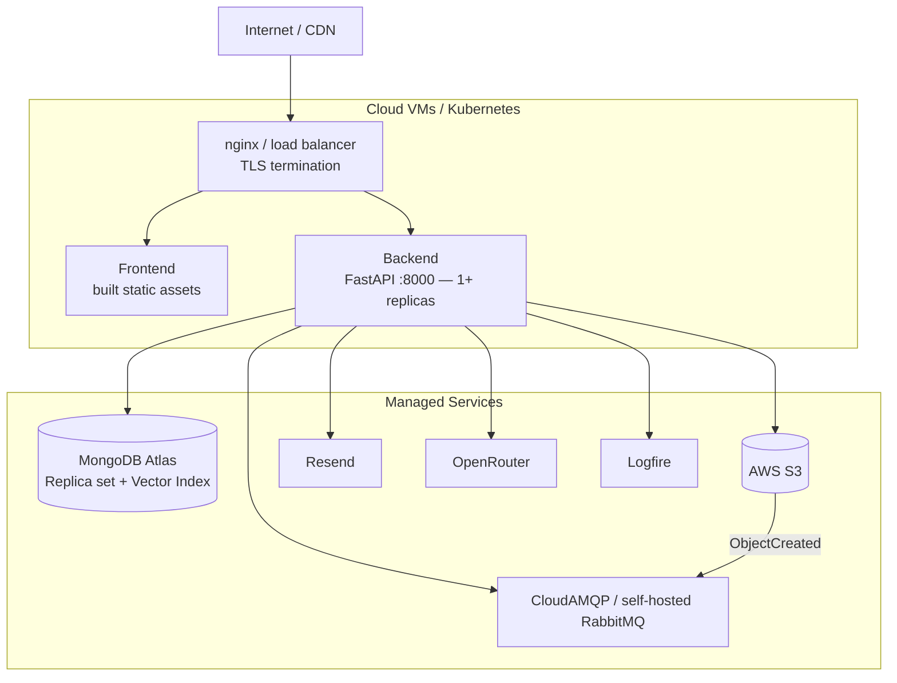

### 15.3 Required Environment Variables (Production)

| Variable | Description |
|---|---|
| `MONGODB_URL` | Atlas connection string with credentials |
| `JWT_SECRET_KEY` | Random 256-bit secret |
| `AWS_ACCESS_KEY_ID` / `AWS_SECRET_ACCESS_KEY` | S3 credentials |
| `S3_BUCKET` / `S3_ENDPOINT_URL` / `S3_PUBLIC_ENDPOINT_URL` | S3 config |
| `RABBITMQ_URL` | AMQP connection string |
| `CHAT_API_KEY` | OpenRouter API key |
| `RESEND_API_KEY` / `RESEND_FROM_EMAIL` | Email credentials |
| `CORS_ORIGINS` | JSON array of allowed origins |
| `VITE_API_URL` | Public API URL for frontend build |

---

## Appendix A — Report Content Schemas

| Report Type | Content Shape |
|---|---|
| `briefing` | `{title, summary, key_points[], takeaways[]}` |
| `study_guide` | `{title, sections[{heading, content}]}` |
| `blog` | `{title, subtitle, body_markdown}` |
| `mindmap` | `{title, root_node{label, children[]}}` |
| `quiz` | `{title, questions[{question, options[], answer, explanation}]}` |
| `flashcards` | `{title, cards[{front, back}]}` |
| `custom` | `{title, content_markdown}` |
| `note` | `{title, content}` (inline note, no LLM) |

## Appendix B — Chunk Vector Index

Atlas vector search index name: `notebook_chunks_vector_index`

- **Path:** `content` (Atlas auto-embeds the raw string server-side)
- **Similarity:** cosine
- **Pre-filter fields:** `notebook_id`, `user_id` (both stored as BSON Binary UUIDs)
- UUIDs must be wrapped with `Binary.from_uuid(...)` in `$vectorSearch` filter expressions

---

*End of SRS — Aviary Personal RAG Platform v1.0*
